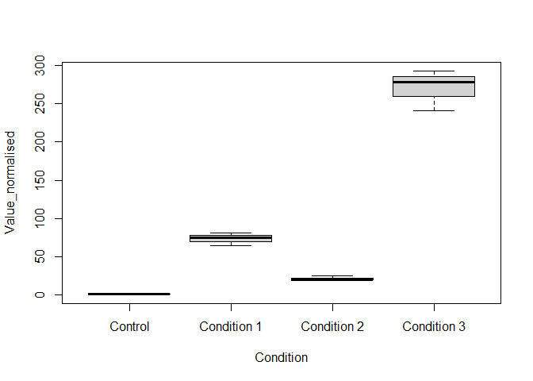
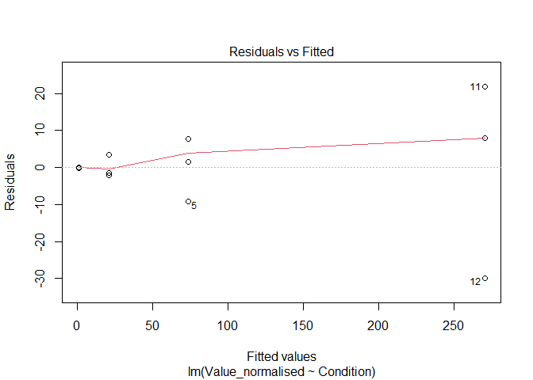
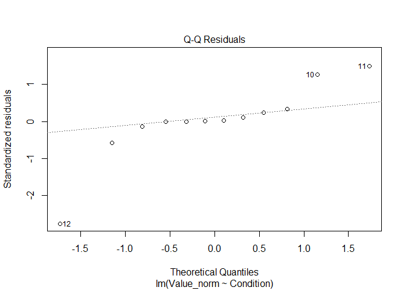
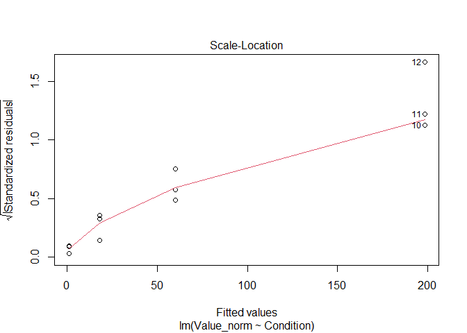
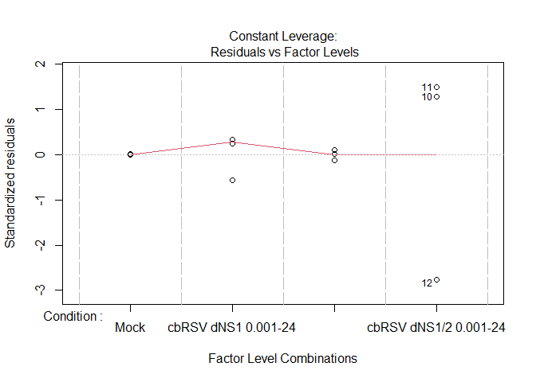
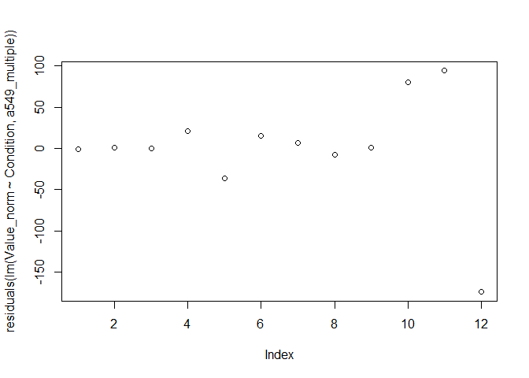

Statistics Pipeline
================
Last edited: 2024-10-23

# Testing Statistical Assumptions

``` r
# Replace 'a549_multiple' and 'a549_single' in the workbook
```

## Visual Tests

#### Normal Distribution by Boxplot

``` r
boxplot(Value_norm~Condition, a549_multiple)
```

<!-- -->

#### Testing equality of variance assumptions

``` r
plot(lm(Value_norm~Condition, a549_multiple))
```

<!-- --><!-- --><!-- --><!-- -->

**1st and the last plots:** we want symetrical data about the 0
horizontal line

**2nd plot:** we want residual points to be as close to the predicted
line as possible

**3rd plot:** we want for red line to be approx. horizontal

## Mathematical tests

### Testing Normality

#### Test Normality (of distribution) per treatment group

**p value \> 0.05 means normal distribution**

``` r
shapiro.test(a549_multiple$Value_norm[1:3])
```

    ## 
    ##  Shapiro-Wilk normality test
    ## 
    ## data:  a549_multiple$Value_norm[1:3]
    ## W = 0.99269, p-value = 0.8365

``` r
shapiro.test(a549_multiple$Value_norm[4:6])
```

    ## 
    ##  Shapiro-Wilk normality test
    ## 
    ## data:  a549_multiple$Value_norm[4:6]
    ## W = 0.83046, p-value = 0.1895

``` r
shapiro.test(a549_multiple$Value_norm[7:9])
```

    ## 
    ##  Shapiro-Wilk normality test
    ## 
    ## data:  a549_multiple$Value_norm[7:9]
    ## W = 0.97776, p-value = 0.7141

``` r
shapiro.test(a549_multiple$Value_norm[10:12])
```

    ## 
    ##  Shapiro-Wilk normality test
    ## 
    ## data:  a549_multiple$Value_norm[10:12]
    ## W = 0.78884, p-value = 0.08813

#### Test Normality (of distribution) for the whole dataset

Visual assessment where you want the residual points to be as close line
as possible.

``` r
plot(residuals(lm(Value_norm~Condition, a549_multiple)))
```

<!-- -->

``` r
shapiro.test(residuals(lm(Value_norm~Condition, a549_multiple)))
```

    ## 
    ##  Shapiro-Wilk normality test
    ## 
    ## data:  residuals(lm(Value_norm ~ Condition, a549_multiple))
    ## W = 0.80078, p-value = 0.009563

If all groups and combined analysis evaluate to normal distribution then
its normal. If one group is non normal by itself but combined dataset
evaluates to normal distribution usually you can assume its normal
distribution.

### Testing the Equality of Variance

#### For **NORMAL** Distribution

**p value \> 0.05 means equal variance**

``` r
bartlett.test(Value_norm~Condition, a549_multiple)
```

    ## 
    ##  Bartlett test of homogeneity of variances
    ## 
    ## data:  Value_norm by Condition
    ## Bartlett's K-squared = 24.76, df = 3, p-value = 1.733e-05

#### For **NON NORMAL** Distribution

**p value \> 0.05 means equal variance**

``` r
library(car, quietly = T)
```

    ## 
    ## Attaching package: 'car'

    ## The following object is masked from 'package:dplyr':
    ## 
    ##     recode

    ## The following object is masked from 'package:purrr':
    ## 
    ##     some

``` r
leveneTest(Value_norm~Condition, a549_multiple)
```

    ## Levene's Test for Homogeneity of Variance (center = median)
    ##       Df F value Pr(>F)
    ## group  3  0.9692 0.4534
    ##        8

# Obtaining Statistical Parameters

## For **Normal Distribution** and **Equal Variance**

### Multiple Comparisons

``` r
aov(lm(Value_norm~Condition, a549_multiple))
```

    ## Call:
    ##    aov(formula = lm(Value_norm ~ Condition, a549_multiple))
    ## 
    ## Terms:
    ##                 Condition Residuals
    ## Sum of Squares   72005.40  47520.11
    ## Deg. of Freedom         3         8
    ## 
    ## Residual standard error: 77.07148
    ## Estimated effects may be unbalanced

Anova finds there is any significant difference across the whole
dataset. If the p-value (Pr(\>F) is **ABOVE** 0.05 the analysis should
be stopped here!

Important parameters: F value and Pr(\>F) (include in reports)

``` r
TukeyHSD(aov(Value_norm~Condition, a549_multiple))
```

    ##   Tukey multiple comparisons of means
    ##     95% family-wise confidence level
    ## 
    ## Fit: aov(formula = Value_norm ~ Condition, data = a549_multiple)
    ## 
    ## $Condition
    ##                                                diff         lwr      upr
    ## cbRSV dNS1 0.001-24-Mock                   59.17966 -142.339880 260.6992
    ## cbRSV dNS2 0.01-24-Mock                    17.06476 -184.454777 218.5843
    ## cbRSV dNS1/2 0.001-24-Mock                197.25232   -4.267219 398.7719
    ## cbRSV dNS2 0.01-24-cbRSV dNS1 0.001-24    -42.11490 -243.634436 159.4046
    ## cbRSV dNS1/2 0.001-24-cbRSV dNS1 0.001-24 138.07266  -63.446878 339.5922
    ## cbRSV dNS1/2 0.001-24-cbRSV dNS2 0.01-24  180.18756  -21.331981 381.7071
    ##                                               p adj
    ## cbRSV dNS1 0.001-24-Mock                  0.7849860
    ## cbRSV dNS2 0.01-24-Mock                   0.9924778
    ## cbRSV dNS1/2 0.001-24-Mock                0.0550105
    ## cbRSV dNS2 0.01-24-cbRSV dNS1 0.001-24    0.9057790
    ## cbRSV dNS1/2 0.001-24-cbRSV dNS1 0.001-24 0.2043904
    ## cbRSV dNS1/2 0.001-24-cbRSV dNS2 0.01-24  0.0806780

P adj are the individual p values between group combinations.

### Single Comparison

``` r
t.test(Value_norm~Condition, 
       data=a549_single, 
       alternative='two.sided',
       var.equal=T)
```

    ## 
    ##  Two Sample t-test
    ## 
    ## data:  Value_norm by Condition
    ## t = -3.2839, df = 4, p-value = 0.03039
    ## alternative hypothesis: true difference in means between group Mock and group cbRSV dNS1 0.001-24 is not equal to 0
    ## 95 percent confidence interval:
    ##  -109.214377   -9.144942
    ## sample estimates:
    ##                mean in group Mock mean in group cbRSV dNS1 0.001-24 
    ##                           1.00000                          60.17966

Important parameters: t and p-value (include in reports)

## For **Non Normal Distribution** but **Equal Variance**

### Multiple Comparisons

``` r
library(dunn.test, quietly = T)
dunn.test(a549_multiple$Value_norm, 
          a549_multiple$Condition, 
          altp=T,
          list=T)
```

    ##   Kruskal-Wallis rank sum test
    ## 
    ## data: x and group
    ## Kruskal-Wallis chi-squared = 8.4359, df = 3, p-value = 0.04
    ## 
    ## 
    ##                            Comparison of x by group                            
    ##                                 (No adjustment)                                
    ## Col Mean-|
    ## Row Mean |   cbRSV dN   cbRSV dN   cbRSV dN
    ## ---------+---------------------------------
    ## cbRSV dN |  -0.566138
    ##          |     0.5713
    ##          |
    ## cbRSV dN |   0.905821   1.471960
    ##          |     0.3650     0.1410
    ##          |
    ##     Mock |   2.151326   2.717464   1.245504
    ##          |    0.0315*    0.0066*     0.2129
    ## 
    ## 
    ## List of pairwise comparisons: Z statistic (p-value)
    ## -----------------------------------------------------------------
    ## cbRSV dNS1 0.001-24 - cbRSV dNS1/2 0.001-24 : -0.566138 (0.5713)
    ## cbRSV dNS1 0.001-24 - cbRSV dNS2 0.01-24    :  0.905821 (0.3650)
    ## cbRSV dNS1/2 0.001-24 - cbRSV dNS2 0.01-24  :  1.471960 (0.1410)
    ## cbRSV dNS1 0.001-24 - Mock                  :  2.151326 (0.0315)*
    ## cbRSV dNS1/2 0.001-24 - Mock                :  2.717464 (0.0066)*
    ## cbRSV dNS2 0.01-24 - Mock                   :  1.245504 (0.2129)
    ## 
    ## alpha = 0.05
    ## Reject Ho if p <= alpha

Kruskal test finds there is any significant difference across the whole
dataset. If the p-value is **ABOVE** 0.05 the analysis should be stopped
here without comparing groups!

Important parameters: chi-squared and p-value (include in reports)

The dunn test displays both comparison matrix and comparison list of
tested groups. P values are the individual p values between group
combinations.

### Simple Comparison

``` r
t.test(Value_norm~Condition, 
       data= a549_single, 
       alternative='two.sided',
       var.equal=T)
```

    ## 
    ##  Two Sample t-test
    ## 
    ## data:  Value_norm by Condition
    ## t = -3.2839, df = 4, p-value = 0.03039
    ## alternative hypothesis: true difference in means between group Mock and group cbRSV dNS1 0.001-24 is not equal to 0
    ## 95 percent confidence interval:
    ##  -109.214377   -9.144942
    ## sample estimates:
    ##                mean in group Mock mean in group cbRSV dNS1 0.001-24 
    ##                           1.00000                          60.17966

Important parameters: t and p-value (include in reports)

## For **Normal Distribution** but **Non Equal Variance**

### Multiple Comparisons

``` r
oneway.test(Value_norm~Condition, 
            a549_multiple, 
            var.equal = F)
```

    ## 
    ##  One-way analysis of means (not assuming equal variances)
    ## 
    ## data:  Value_norm and Condition
    ## F = 7.3952, num df = 3.0000, denom df = 3.3461, p-value = 0.05631

One-way analysis of means finds there is any significant difference
across the whole dataset. If the p-value is **ABOVE** 0.05 the analysis
should be stopped here!

Important parameters: F value and Pr(\>F) (include in reports)

``` r
library(rstatix, quietly = T)
```

    ## 
    ## Attaching package: 'rstatix'

    ## The following object is masked from 'package:stats':
    ## 
    ##     filter

``` r
library(dplyr, quietly = T)
a549_multiple %>% games_howell_test(Value_norm~Condition)
```

    ## # A tibble: 6 × 8
    ##   .y.        group1        group2 estimate conf.low conf.high p.adj p.adj.signif
    ## * <chr>      <chr>         <chr>     <dbl>    <dbl>     <dbl> <dbl> <chr>       
    ## 1 Value_norm Mock          cbRSV…     59.2    -65.6     184.  0.194 ns          
    ## 2 Value_norm Mock          cbRSV…     17.1    -13.0      47.1 0.143 ns          
    ## 3 Value_norm Mock          cbRSV…    197.    -406.      800.  0.343 ns          
    ## 4 Value_norm cbRSV dNS1 0… cbRSV…    -42.1   -156.       72.2 0.325 ns          
    ## 5 Value_norm cbRSV dNS1 0… cbRSV…    138.    -426.      702.  0.536 ns          
    ## 6 Value_norm cbRSV dNS2 0… cbRSV…    180.    -420.      781.  0.388 ns

P adj are the individual p values between group combinations.

### Single Comparison

``` r
t.test(Value_norm~Condition, 
       data=a549_single, 
       alternative='two.sided',
       var.equal=F)
```

    ## 
    ##  Welch Two Sample t-test
    ## 
    ## data:  Value_norm by Condition
    ## t = -3.2839, df = 2.0013, p-value = 0.08148
    ## alternative hypothesis: true difference in means between group Mock and group cbRSV dNS1 0.001-24 is not equal to 0
    ## 95 percent confidence interval:
    ##  -136.67077   18.31145
    ## sample estimates:
    ##                mean in group Mock mean in group cbRSV dNS1 0.001-24 
    ##                           1.00000                          60.17966

Important parameters: t and p-value (include in reports)
