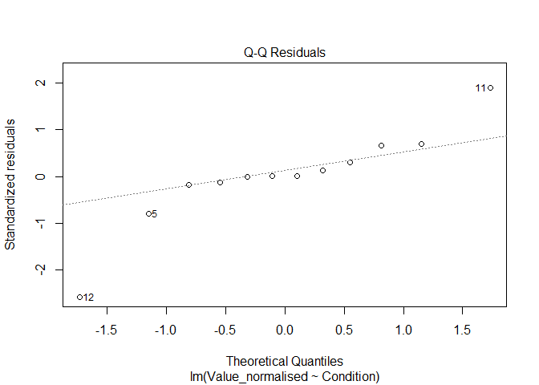
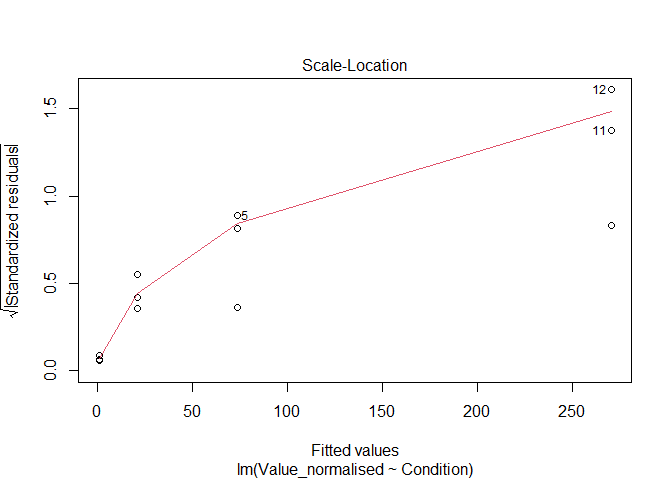
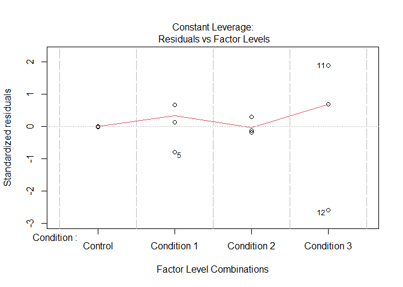
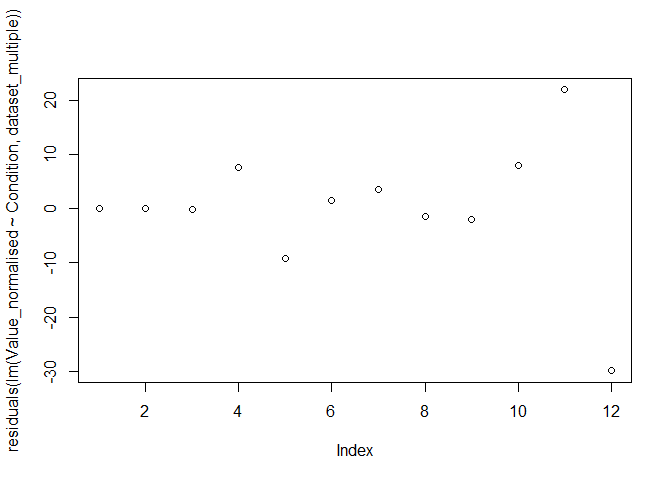

Statistics Pipeline
================
Last edited: 2024-10-24

# Introduction

This workbook acts as a template for statistical analysis. it provides
guidelines for assumptions and test to use for multiple experimental
conditions and single experimental condition.

Below is the sample data for multiple experimental conditions:

``` r
dataset_multiple |> kable()
```

| Target      | Condition   | Value_normalised |
|:------------|:------------|-----------------:|
| Target gene | Control     |        1.0706881 |
| Target gene | Control     |        1.0844842 |
| Target gene | Control     |        0.9448277 |
| Target gene | Condition 1 |       81.2009694 |
| Target gene | Condition 1 |       64.3204167 |
| Target gene | Condition 1 |       75.0175918 |
| Target gene | Condition 2 |       24.9020700 |
| Target gene | Condition 2 |       19.9231473 |
| Target gene | Condition 2 |       19.3690698 |
| Target gene | Condition 3 |      278.2460496 |
| Target gene | Condition 3 |      292.1552481 |
| Target gene | Condition 3 |      240.3556637 |

Below is the sample data for one experimental condition:

``` r
dataset_single |> kable()
```

| Target      | Condition   | Value_normalised |
|:------------|:------------|-----------------:|
| Target gene | Control     |        1.0706881 |
| Target gene | Control     |        1.0844842 |
| Target gene | Control     |        0.9448277 |
| Target gene | Condition 1 |       81.2009694 |
| Target gene | Condition 1 |       64.3204167 |
| Target gene | Condition 1 |       75.0175918 |

# Testing Statistical Assumptions

## Visual Tests

#### Normal Distribution by Boxplot

``` r
boxplot(Value_normalised~Condition, dataset_multiple)
```

<!-- -->

#### Testing equality of variance assumptions

``` r
plot(lm(Value_normalised~Condition, dataset_multiple))
```

<!-- --><!-- --><!-- --><!-- -->

**1st and the last plots:** we want symmetrical data about the 0
horizontal line

**2nd plot:** we want residual points to be as close to the predicted
line as possible

**3rd plot:** we want for red line to be approx. horizontal

## Mathematical tests

### Testing Normality

#### Test Normality (of distribution) per treatment group

**p value \> 0.05 means normal distribution**

``` r
shapiro.test(dataset_multiple$Value_normalised[1:3]) # test all values in one condition
```

    ## 
    ##  Shapiro-Wilk normality test
    ## 
    ## data:  dataset_multiple$Value_normalised[1:3]
    ## W = 0.8233, p-value = 0.1714

``` r
shapiro.test(dataset_multiple$Value_normalised[4:6]) # test all values in one condition
```

    ## 
    ##  Shapiro-Wilk normality test
    ## 
    ## data:  dataset_multiple$Value_normalised[4:6]
    ## W = 0.97672, p-value = 0.7075

``` r
shapiro.test(dataset_multiple$Value_normalised[7:9]) # test all values in one condition
```

    ## 
    ##  Shapiro-Wilk normality test
    ## 
    ## data:  dataset_multiple$Value_normalised[7:9]
    ## W = 0.82428, p-value = 0.1739

``` r
shapiro.test(dataset_multiple$Value_normalised[10:12]) # test all values in one condition
```

    ## 
    ##  Shapiro-Wilk normality test
    ## 
    ## data:  dataset_multiple$Value_normalised[10:12]
    ## W = 0.93332, p-value = 0.5012

#### Test Normality (of distribution) for the whole dataset

Visual assessment where you want the residual points to be as close line
as possible.

``` r
plot(residuals(lm(Value_normalised~Condition, dataset_multiple))) # test all values in the whole dataset
```

<!-- -->

``` r
shapiro.test(residuals(lm(Value_normalised~Condition, dataset_multiple))) # test all values in the whole dataset
```

    ## 
    ##  Shapiro-Wilk normality test
    ## 
    ## data:  residuals(lm(Value_normalised ~ Condition, dataset_multiple))
    ## W = 0.86807, p-value = 0.06177

If all groups and combined analysis evaluate to normal distribution then
its normal. If one group is non normal by itself but combined dataset
evaluates to normal distribution usually you can assume its normal
distribution.

### Testing the Equality of Variance

#### For **NORMAL** Distribution

**p value \> 0.05 means equal variance**

``` r
bartlett.test(Value_normalised~Condition, dataset_multiple)
```

    ## 
    ##  Bartlett test of homogeneity of variances
    ## 
    ## data:  Value_normalised by Condition
    ## Bartlett's K-squared = 21.9, df = 3, p-value = 6.842e-05

#### For **NON NORMAL** Distribution

**p value \> 0.05 means equal variance**

``` r
library(car, quietly = TRUE)
```

    ## 
    ## Attaching package: 'car'

    ## The following object is masked from 'package:dplyr':
    ## 
    ##     recode

    ## The following object is masked from 'package:purrr':
    ## 
    ##     some

``` r
leveneTest(Value_normalised~Condition, dataset_multiple)
```

    ## Levene's Test for Homogeneity of Variance (center = median)
    ##       Df F value Pr(>F)
    ## group  3    1.78 0.2286
    ##        8

# Obtaining Statistical Parameters

## For **Normal Distribution** and **Equal Variance**

### Multiple Comparisons

``` r
aov(lm(Value_normalised~Condition, dataset_multiple))
```

    ## Call:
    ##    aov(formula = lm(Value_normalised ~ Condition, dataset_multiple))
    ## 
    ## Terms:
    ##                 Condition Residuals
    ## Sum of Squares   136123.2    1601.9
    ## Deg. of Freedom         3         8
    ## 
    ## Residual standard error: 14.15054
    ## Estimated effects may be unbalanced

Anova finds there is any significant difference across the whole
dataset. If the p-value (Pr(\>F) is **ABOVE** 0.05 the analysis should
be stopped here!

Important parameters: F value and Pr(\>F) (include in reports)

``` r
TukeyHSD(aov(Value_normalised~Condition, dataset_multiple))
```

    ##   Tukey multiple comparisons of means
    ##     95% family-wise confidence level
    ## 
    ## Fit: aov(formula = Value_normalised ~ Condition, data = dataset_multiple)
    ## 
    ## $Condition
    ##                              diff       lwr       upr     p adj
    ## Condition 1-Control      72.47966  35.48011 109.47921 0.0010826
    ## Condition 2-Control      20.36476 -16.63479  57.36431 0.3554778
    ## Condition 3-Control     269.21899 232.21943 306.21854 0.0000000
    ## Condition 2-Condition 1 -52.11490 -89.11445 -15.11534 0.0085256
    ## Condition 3-Condition 1 196.73933 159.73978 233.73888 0.0000007
    ## Condition 3-Condition 2 248.85422 211.85467 285.85378 0.0000001

P adj are the individual p values between group combinations.

### Single Comparison

``` r
t.test(Value_normalised~Condition, 
       data=dataset_single, 
       alternative='two.sided',
       var.equal=T)
```

    ## 
    ##  Two Sample t-test
    ## 
    ## data:  Value_normalised by Condition
    ## t = -14.699, df = 4, p-value = 0.0001247
    ## alternative hypothesis: true difference in means between group Control and group Condition 1 is not equal to 0
    ## 95 percent confidence interval:
    ##  -86.17010 -58.78922
    ## sample estimates:
    ##     mean in group Control mean in group Condition 1 
    ##                  1.033333                 73.512993

Important parameters: t and p-value (include in reports)

## For **Non Normal Distribution** but **Equal Variance**

### Multiple Comparisons

``` r
library(dunn.test, quietly = T)
dunn.test(dataset_multiple$Value_normalised, 
          dataset_multiple$Condition, 
          altp=T,
          list=T)
```

    ##   Kruskal-Wallis rank sum test
    ## 
    ## data: x and group
    ## Kruskal-Wallis chi-squared = 10.3846, df = 3, p-value = 0.02
    ## 
    ## 
    ##                            Comparison of x by group                            
    ##                                 (No adjustment)                                
    ## Col Mean-|
    ## Row Mean |   Conditio   Conditio   Conditio
    ## ---------+---------------------------------
    ## Conditio |   1.019049
    ##          |     0.3082
    ##          |
    ## Conditio |  -1.019049  -2.038098
    ##          |     0.3082    0.0415*
    ##          |
    ##  Control |   2.038098   1.019049   3.057147
    ##          |    0.0415*     0.3082    0.0022*
    ## 
    ## 
    ## List of pairwise comparisons: Z statistic (p-value)
    ## -----------------------------------------------
    ## Condition 1 - Condition 2 :  1.019049 (0.3082)
    ## Condition 1 - Condition 3 : -1.019049 (0.3082)
    ## Condition 2 - Condition 3 : -2.038098 (0.0415)*
    ## Condition 1 - Control     :  2.038098 (0.0415)*
    ## Condition 2 - Control     :  1.019049 (0.3082)
    ## Condition 3 - Control     :  3.057147 (0.0022)*
    ## 
    ## alpha = 0.05
    ## Reject Ho if p <= alpha

Kruskal test finds there is any significant difference across the whole
dataset. If the p-value is **ABOVE** 0.05 the analysis should be stopped
here without comparing groups!

Important parameters: chi-squared and p-value (include in reports)

The dunn test displays both comparison matrix and comparison list of
tested groups. P values are the individual p values between group
combinations.

### Simple Comparison

``` r
t.test(Value_normalised~Condition, 
       data= dataset_single, 
       alternative='two.sided',
       var.equal=T)
```

    ## 
    ##  Two Sample t-test
    ## 
    ## data:  Value_normalised by Condition
    ## t = -14.699, df = 4, p-value = 0.0001247
    ## alternative hypothesis: true difference in means between group Control and group Condition 1 is not equal to 0
    ## 95 percent confidence interval:
    ##  -86.17010 -58.78922
    ## sample estimates:
    ##     mean in group Control mean in group Condition 1 
    ##                  1.033333                 73.512993

Important parameters: t and p-value (include in reports)

## For **Normal Distribution** but **Non Equal Variance**

### Multiple Comparisons

``` r
oneway.test(Value_normalised~Condition, 
            dataset_multiple, 
            var.equal = F)
```

    ## 
    ##  One-way analysis of means (not assuming equal variances)
    ## 
    ## data:  Value_normalised and Condition
    ## F = 155.35, num df = 3.0000, denom df = 3.3349, p-value = 0.000459

One-way analysis of means finds there is any significant difference
across the whole dataset. If the p-value is **ABOVE** 0.05 the analysis
should be stopped here!

Important parameters: F value and Pr(\>F) (include in reports)

``` r
library(rstatix, quietly = T)
```

    ## 
    ## Attaching package: 'rstatix'

    ## The following object is masked from 'package:stats':
    ## 
    ##     filter

``` r
library(dplyr, quietly = T)
dataset_multiple %>% games_howell_test(Value_normalised~Condition)
```

    ## # A tibble: 6 × 8
    ##   .y.              group1  group2 estimate conf.low conf.high p.adj p.adj.signif
    ## * <chr>            <chr>   <chr>     <dbl>    <dbl>     <dbl> <dbl> <chr>       
    ## 1 Value_normalised Control Condi…     72.5    38.3      107.  0.012 *           
    ## 2 Value_normalised Control Condi…     20.4     8.19      32.5 0.018 *           
    ## 3 Value_normalised Control Condi…    269.    162.       376.  0.008 **          
    ## 4 Value_normalised Condit… Condi…    -52.1   -81.2      -23.0 0.012 *           
    ## 5 Value_normalised Condit… Condi…    197.    103.       290.  0.009 **          
    ## 6 Value_normalised Condit… Condi…    249.    144.       354.  0.009 **

P adj are the individual p values between group combinations.

### Single Comparison

``` r
t.test(Value_normalised~Condition, 
       data=dataset_single, 
       alternative='two.sided',
       var.equal=F)
```

    ## 
    ##  Welch Two Sample t-test
    ## 
    ## data:  Value_normalised by Condition
    ## t = -14.699, df = 2.0003, p-value = 0.004593
    ## alternative hypothesis: true difference in means between group Control and group Condition 1 is not equal to 0
    ## 95 percent confidence interval:
    ##  -93.69241 -51.26690
    ## sample estimates:
    ##     mean in group Control mean in group Condition 1 
    ##                  1.033333                 73.512993

Important parameters: t and p-value (include in reports)
