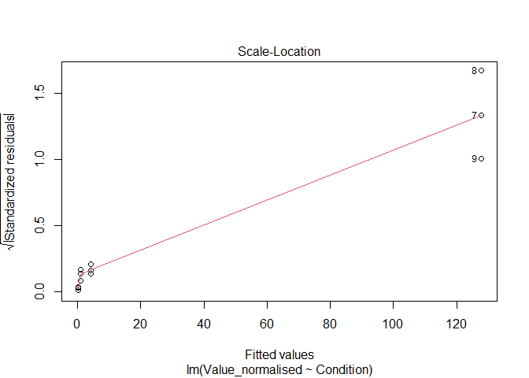
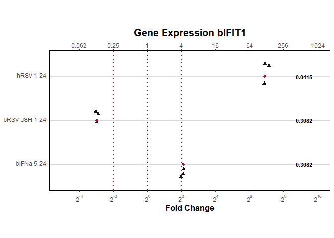

Example of qPCR Pipeline Usage
================
Michal Varga
Last edited: 2024-10-25

# Introduction

Purpose:

based on scripts:

- [standard curve](/Scripts/standard_curve.R)
- [control gene Ct based](/Scripts/standard_curve.R)
- [Copy number GAPDH normalised dataset](/Scripts/standard_curve.R)

parameters incuded in script:

- `target_gene:` bIFIT1
- `primer_set`: PS11
- `housekeeping_gene:` bGAPDH
- `cell_line`: MDBK
- `conditions:` !r c(‘Mock’, ‘hRSV 1-24’, ‘bRSV dSH 1-24’, ‘bIFNa 5-24’)

Link to [stats pipeline]()

## Libraries (maybe put them when they are used?)

``` r
library(tidyverse) # for data manipulation
library(data.table) # for fast data reading and writing
library(scales) # for log10 axis on figures
```

# 1. Standard Curve

## Introduction

Some text about what the fuck

## Data Loading

Load `standard_curves_data.csv` from `/Data` folder, and filter the
target gene and primer set used based on the declared parameters in
YAML.

``` r
standard_curve_data <- fread('../Data/standard_curves_data.csv') %>%
  filter(Target == params$target_gene,
         Primer_set == params$primer_set)
```

|        Ct | Copy_number | Primer_set | Target | Experiment | Additional_info |
|----------:|------------:|:-----------|:-------|:-----------|:----------------|
|  7.664552 |       1e+08 | PS11       | bIFIT1 | NA         | NA              |
| 11.265419 |       1e+07 | PS11       | bIFIT1 | NA         | NA              |
| 14.448029 |       1e+06 | PS11       | bIFIT1 | NA         | NA              |
| 17.917984 |       1e+05 | PS11       | bIFIT1 | NA         | NA              |
| 21.056202 |       1e+04 | PS11       | bIFIT1 | NA         | NA              |
| 22.973955 |       1e+03 | PS11       | bIFIT1 | NA         | NA              |
| 26.622187 |       1e+02 | PS11       | bIFIT1 | NA         | NA              |

## Linear Model Production

### Construct Linear Model

Text about what we do in this step

``` r
model_standard_curve <- lm(log10(Copy_number)~Ct, data = standard_curve_data)
```

    ## 
    ## Call:
    ## lm(formula = log10(Copy_number) ~ Ct, data = standard_curve_data)
    ## 
    ## Coefficients:
    ## (Intercept)           Ct  
    ##     10.5888      -0.3208

### Construct a Prediction Based on the Linear Model

Text about what we do in this step

``` r
prediction_model_standard_curve <- 10^predict(
  model_standard_curve, 
  interval = 'prediction')
```

    ## Warning in predict.lm(model_standard_curve, interval = "prediction"): predictions on current data refer to _future_ responses

|          fit |          lwr |          upr |
|-------------:|-------------:|-------------:|
| 1.348840e+08 | 4.340240e+07 | 4.191860e+08 |
| 9.436060e+06 | 3.300113e+06 | 2.698066e+07 |
| 8.990821e+05 | 3.288738e+05 | 2.457929e+06 |
| 6.928302e+04 | 2.569156e+04 | 1.868371e+05 |
| 6.821448e+03 | 2.478090e+03 | 1.877743e+04 |
| 1.654456e+03 | 5.848611e+02 | 4.680130e+03 |
| 1.117612e+02 | 3.650013e+01 | 3.422060e+02 |

Text about what we do in this step

``` r
data_combined_standard_curve <- cbind(
  standard_curve_data,
  prediction_model_standard_curve)
```

| Ct | Copy_number | Primer_set | Target | Experiment | Additional_info | fit | lwr | upr |
|---:|---:|:---|:---|:---|:---|---:|---:|---:|
| 7.664552 | 1e+08 | PS11 | bIFIT1 | NA | NA | 1.348840e+08 | 4.340240e+07 | 4.191860e+08 |
| 11.265419 | 1e+07 | PS11 | bIFIT1 | NA | NA | 9.436060e+06 | 3.300113e+06 | 2.698066e+07 |
| 14.448029 | 1e+06 | PS11 | bIFIT1 | NA | NA | 8.990821e+05 | 3.288738e+05 | 2.457929e+06 |
| 17.917984 | 1e+05 | PS11 | bIFIT1 | NA | NA | 6.928302e+04 | 2.569156e+04 | 1.868371e+05 |
| 21.056202 | 1e+04 | PS11 | bIFIT1 | NA | NA | 6.821448e+03 | 2.478090e+03 | 1.877743e+04 |
| 22.973955 | 1e+03 | PS11 | bIFIT1 | NA | NA | 1.654456e+03 | 5.848611e+02 | 4.680130e+03 |
| 26.622187 | 1e+02 | PS11 | bIFIT1 | NA | NA | 1.117612e+02 | 3.650013e+01 | 3.422060e+02 |

### Calculate Amplification Efficiency

Some text about what the fuck are we doing

``` math
\text{Amplification Efficiency} = 10^{-1/\text{slope}}-1
```

``` r
efficiency_standard_curve <- paste(
  round(
    (10^(-1/ lm(Ct~log10(Copy_number),
                data = standard_curve_data)[[1]][2]) -1)*100,
    digits = 2),
  '% Amplification Efficiency',
  sep = '')
```

    ## [1] "110% Amplification Efficiency"

## Figure of Standard Curve

### Constructing Figure

Text about what we do in this step

``` r
plot_title_standard_curve <- paste(params$target_gene, 
                    '-', 
                    params$primer_set,
                    'Standard Curve', 
                    sep = " ")
x_annotation_position_standard_curve <- 1000000
y_annotation_position_standard_curve <- 37.5
top_range_standard_curve <- 40
y_axis_title_standard_curve <- 'Cycle Threshold'
x_axis_title_standard_curve <- 'Copy Number'
```

Text about what we do in this step

``` r
plot_standard_curve <- ggplot(
  data = data_combined_standard_curve,
  mapping = aes(x = Copy_number,
                y = Ct)) +
  geom_point() +
  stat_smooth(method = lm) +
  labs(
    title = plot_title_standard_curve,
    y = x_axis_title_standard_curve,
    x = y_axis_title_standard_curve)
```

Text about what we do in this step

``` r
plot_standard_curve <- plot_standard_curve +
  scale_y_continuous(
    breaks = seq(from = 0, 
                 to = top_range_standard_curve, 
                 by = 10),
    limits = c(0,top_range_standard_curve))
```

Text about what we do in this step

``` r
plot_standard_curve <- plot_standard_curve +
  scale_x_log10(
    labels = trans_format("log10", 
                          math_format(10^.x)),
    breaks = trans_breaks("log10", 
                          function(x) 10^x)) +
  annotation_logticks(sides='b')
```

Text about what we do in this step

``` r
plot_standard_curve <- plot_standard_curve +
  theme_bw() +
  theme(
  plot.title = element_text(
    size = 15, 
    face = 'bold', 
    margin = margin(8, 0, 8, 0), 
    hjust = 0.5),
  axis.text.y = element_text(
    angle = 0, 
    size = 9, 
    vjust = 0.5),
  axis.text.x.bottom = element_text(
    angle = 0, 
    size = 9, 
    vjust = 0.5),
  axis.title.x = element_text(
    size = 12, 
    face = 'bold', 
    vjust = -0.5, 
    margin = margin(0, 8, 0, 0)),
  axis.title.y = element_text(
    size = 12, 
    face='bold', 
    vjust=-0.5, 
    margin = margin(0, 8, 0, 0)),
  aspect.ratio = 1/2)
```

Text about what we do in this step

``` r
plot_standard_curve <- plot_standard_curve +
  annotate('text',
           y = y_annotation_position_standard_curve, 
           x = x_annotation_position_standard_curve, 
           label = efficiency_standard_curve, 
           size = 5)
```

    ## `geom_smooth()` using formula = 'y ~ x'

<!-- -->

### Saving Figure

Text about what we do in this step

``` r
ggsave(filename = paste(
  paste("plot_standard_curve", 
                    params$target_gene, 
                    params$primer_set,
                    sep = "_"), '.png', sep = ''), 
       plot = plot_standard_curve, 
       device = 'png', 
       path = '../Figures', 
       dpi = 600, 
       height = 12, 
       width = 20, 
       units = 'cm')
```

    ## `geom_smooth()` using formula = 'y ~ x'

# 2. Housekeeping Gene Control

## Introduction

Some text about what the fuck

## Data Loading

Load `ct_data.csv` from `/Data` folder, and filter the target gene and
primer set used based on the declared parameters in YAML.

``` r
housekeeping_data <- fread('../Data/ct_data.csv') %>% 
  filter(Target == params$housekeeping_gene, 
         Cell_line == params$cell_line,
         Condition %in% params$conditions)
```

|       Ct | Target | Condition     | Cell_line | Additional_info |
|---------:|:-------|:--------------|:----------|:----------------|
| 21.78984 | bGAPDH | bIFNa 5-24    | MDBK      | NA              |
| 22.09733 | bGAPDH | bIFNa 5-24    | MDBK      | NA              |
| 21.47008 | bGAPDH | bIFNa 5-24    | MDBK      | NA              |
| 25.22434 | bGAPDH | bRSV dSH 1-24 | MDBK      | NA              |
| 26.25955 | bGAPDH | bRSV dSH 1-24 | MDBK      | NA              |
| 25.54487 | bGAPDH | bRSV dSH 1-24 | MDBK      | NA              |
| 22.78984 | bGAPDH | hRSV 1-24     | MDBK      | NA              |
| 22.28562 | bGAPDH | hRSV 1-24     | MDBK      | NA              |
| 21.41880 | bGAPDH | hRSV 1-24     | MDBK      | NA              |
| 22.23001 | bGAPDH | Mock          | MDBK      | NA              |
| 22.17195 | bGAPDH | Mock          | MDBK      | NA              |
| 22.01028 | bGAPDH | Mock          | MDBK      | NA              |

## Processing Data

write about what the fuck is happening

equation for ddCt for housekeeping (CHANGE ME!!!)

``` math
\text{Relative Quantification} = 2^{\Updelta\Updelta \text{Ct}}
```

``` math
\Updelta\Updelta \text{Ct} = \Updelta \text{Ct}_{\text{Test Samples}}-\Updelta \text{Ct}_{\text{Calibrator Samples}}
```

``` math
\Updelta \text{Ct}_{\text{Test Samples}} = \text{Ct}_{\text{Target Gene in Tests}}-\text{Ct}_{\text{Reference Gene in Tests}}
```

``` math
\Updelta \text{Ct}_{\text{Calibrator Samples}} = \text{Ct}_{\text{Target Gene in Calibrator}}-\text{Ct}_{\text{Reference Gene in Calibrator}}
```

``` r
ddct_housekeeping_data <- housekeeping_data |> mutate(
  control_mean = mean(
    Ct[Condition == params$conditions[1]],
    na.rm = T),
  log2_dCt = 2^ (- (Ct - control_mean)),
  control_mean_log = mean(
    log2_dCt[Condition == params$conditions[1]],
    na.rm = T),
  Value_normalised = log2_dCt / control_mean_log)
```

| Ct | Target | Condition | Cell_line | Additional_info | control_mean | log2_dCt | control_mean_log | Value_normalised |
|---:|:---|:---|:---|:---|---:|---:|---:|---:|
| 21.78984 | bGAPDH | bIFNa 5-24 | MDBK | NA | 22.13742 | 1.2724156 | 1.0021 | 1.2697492 |
| 22.09733 | bGAPDH | bIFNa 5-24 | MDBK | NA | 22.13742 | 1.0281716 | 1.0021 | 1.0260170 |
| 21.47008 | bGAPDH | bIFNa 5-24 | MDBK | NA | 22.13742 | 1.5881333 | 1.0021 | 1.5848053 |
| 25.22434 | bGAPDH | bRSV dSH 1-24 | MDBK | NA | 22.13742 | 0.1176908 | 1.0021 | 0.1174441 |
| 26.25955 | bGAPDH | bRSV dSH 1-24 | MDBK | NA | 22.13742 | 0.0574268 | 1.0021 | 0.0573064 |
| 25.54487 | bGAPDH | bRSV dSH 1-24 | MDBK | NA | 22.13742 | 0.0942440 | 1.0021 | 0.0940465 |
| 22.78984 | bGAPDH | hRSV 1-24 | MDBK | NA | 22.13742 | 0.6362078 | 1.0021 | 0.6348746 |
| 22.28562 | bGAPDH | hRSV 1-24 | MDBK | NA | 22.13742 | 0.9023694 | 1.0021 | 0.9004784 |
| 21.41880 | bGAPDH | hRSV 1-24 | MDBK | NA | 22.13742 | 1.6455992 | 1.0021 | 1.6421508 |
| 22.23001 | bGAPDH | Mock | MDBK | NA | 22.13742 | 0.9378337 | 1.0021 | 0.9358684 |
| 22.17195 | bGAPDH | Mock | MDBK | NA | 22.13742 | 0.9763464 | 1.0021 | 0.9743004 |
| 22.01028 | bGAPDH | Mock | MDBK | NA | 22.13742 | 1.0921197 | 1.0021 | 1.0898311 |

## Factorisation

Text about what we do in this step

``` r
aggregated_housekeeping_data <- aggregate(x=ddct_housekeeping_data, 
                               by=list(ddct_housekeeping_data$Condition),
                               FUN = mean)
```

    ## Warning in mean.default(X[[i]], ...): argument is not numeric or logical:
    ## returning NA
    ## Warning in mean.default(X[[i]], ...): argument is not numeric or logical:
    ## returning NA
    ## Warning in mean.default(X[[i]], ...): argument is not numeric or logical:
    ## returning NA
    ## Warning in mean.default(X[[i]], ...): argument is not numeric or logical:
    ## returning NA
    ## Warning in mean.default(X[[i]], ...): argument is not numeric or logical:
    ## returning NA
    ## Warning in mean.default(X[[i]], ...): argument is not numeric or logical:
    ## returning NA
    ## Warning in mean.default(X[[i]], ...): argument is not numeric or logical:
    ## returning NA
    ## Warning in mean.default(X[[i]], ...): argument is not numeric or logical:
    ## returning NA
    ## Warning in mean.default(X[[i]], ...): argument is not numeric or logical:
    ## returning NA
    ## Warning in mean.default(X[[i]], ...): argument is not numeric or logical:
    ## returning NA
    ## Warning in mean.default(X[[i]], ...): argument is not numeric or logical:
    ## returning NA
    ## Warning in mean.default(X[[i]], ...): argument is not numeric or logical:
    ## returning NA

| Group.1 | Ct | Target | Condition | Cell_line | Additional_info | control_mean | log2_dCt | control_mean_log | Value_normalised |
|:---|---:|---:|---:|---:|---:|---:|---:|---:|---:|
| bIFNa 5-24 | 21.78575 | NA | NA | NA | NA | 22.13742 | 1.2962402 | 1.0021 | 1.293524 |
| bRSV dSH 1-24 | 25.67625 | NA | NA | NA | NA | 22.13742 | 0.0897872 | 1.0021 | 0.089599 |
| hRSV 1-24 | 22.16476 | NA | NA | NA | NA | 22.13742 | 1.0613921 | 1.0021 | 1.059168 |
| Mock | 22.13742 | NA | NA | NA | NA | 22.13742 | 1.0020999 | 1.0021 | 1.000000 |

Text about what we do in this step

``` r
arranged_aggregated_housekeeping_data <- aggregated_housekeeping_data %>%
  arrange(match(Group.1, params$conditions))
```

| Group.1 | Ct | Target | Condition | Cell_line | Additional_info | control_mean | log2_dCt | control_mean_log | Value_normalised |
|:---|---:|---:|---:|---:|---:|---:|---:|---:|---:|
| Mock | 22.13742 | NA | NA | NA | NA | 22.13742 | 1.0020999 | 1.0021 | 1.000000 |
| hRSV 1-24 | 22.16476 | NA | NA | NA | NA | 22.13742 | 1.0613921 | 1.0021 | 1.059168 |
| bRSV dSH 1-24 | 25.67625 | NA | NA | NA | NA | 22.13742 | 0.0897872 | 1.0021 | 0.089599 |
| bIFNa 5-24 | 21.78575 | NA | NA | NA | NA | 22.13742 | 1.2962402 | 1.0021 | 1.293524 |

Text about what we do in this step

``` r
housekeeping_factor_vector <- rep(arranged_aggregated_housekeeping_data$Value_normalised, each=3)
```

|        x |
|---------:|
| 1.000000 |
| 1.000000 |
| 1.000000 |
| 1.059168 |
| 1.059168 |
| 1.059168 |
| 0.089599 |
| 0.089599 |
| 0.089599 |
| 1.293524 |
| 1.293524 |
| 1.293524 |

# 3. Factorised Copy Number Extrapolation

## Introduction

Some text about what the fuck

## Data loading and filtering

Load `ct_data.csv` from `/Data` folder, and filter the target gene and
primer set used based on the declared parameters in YAML.

``` r
target_data <- fread('../Data/copy_number_extrapolation_data.csv') %>%
  filter(Target == params$target_gene,
         Cell_line == params$cell_line,
         Condition %in% params$conditions)
```

| Copy_number |       Ct | Target | Condition     | Cell_line | Additional_info |
|:------------|---------:|:-------|:--------------|:----------|:----------------|
| NA          | 25.14157 | bIFIT1 | bIFNa 5-24    | MDBK      | NA              |
| NA          | 25.15428 | bIFIT1 | bIFNa 5-24    | MDBK      | NA              |
| NA          | 25.27119 | bIFIT1 | bIFNa 5-24    | MDBK      | NA              |
| NA          | 29.90040 | bIFIT1 | bRSV dSH 1-24 | MDBK      | NA              |
| NA          | 29.76134 | bIFIT1 | bRSV dSH 1-24 | MDBK      | NA              |
| NA          | 29.85236 | bIFIT1 | bRSV dSH 1-24 | MDBK      | NA              |
| NA          | 23.95345 | bIFIT1 | hRSV 1-24     | MDBK      | NA              |
| NA          | 23.68442 | bIFIT1 | hRSV 1-24     | MDBK      | NA              |
| NA          | 23.90436 | bIFIT1 | hRSV 1-24     | MDBK      | NA              |
| NA          | 26.85368 | bIFIT1 | Mock          | MDBK      | NA              |
| NA          | 26.95577 | bIFIT1 | Mock          | MDBK      | NA              |
| NA          | 26.59759 | bIFIT1 | Mock          | MDBK      | NA              |

## Data Wrangling

### Copy number extrapolation

``` r
target_data_modelled <- target_data |> 
  mutate(
    Copy_number = 10^predict(model_standard_curve, 
                             newdata = target_data))
```

| Copy_number |       Ct | Target | Condition     | Cell_line | Additional_info |
|------------:|---------:|:-------|:--------------|:----------|:----------------|
|  333.639607 | 25.14157 | bIFIT1 | bIFNa 5-24    | MDBK      | NA              |
|  330.521864 | 25.15428 | bIFIT1 | bIFNa 5-24    | MDBK      | NA              |
|  303.176194 | 25.27119 | bIFIT1 | bIFNa 5-24    | MDBK      | NA              |
|    9.922701 | 29.90040 | bIFIT1 | bRSV dSH 1-24 | MDBK      | NA              |
|   10.996113 | 29.76134 | bIFIT1 | bRSV dSH 1-24 | MDBK      | NA              |
|   10.281110 | 29.85236 | bIFIT1 | bRSV dSH 1-24 | MDBK      | NA              |
|  802.470892 | 23.95345 | bIFIT1 | hRSV 1-24     | MDBK      | NA              |
|  978.897474 | 23.68442 | bIFIT1 | hRSV 1-24     | MDBK      | NA              |
|  832.106893 | 23.90436 | bIFIT1 | hRSV 1-24     | MDBK      | NA              |
|   94.195160 | 26.85368 | bIFIT1 | Mock          | MDBK      | NA              |
|   87.352478 | 26.95577 | bIFIT1 | Mock          | MDBK      | NA              |
|  113.810273 | 26.59759 | bIFIT1 | Mock          | MDBK      | NA              |

### Factorisation based on housekeeping gene levels

wriet about what the fuck is happening

equation for ddCt

``` math
\text{Relative Quantification} = 2^{\Updelta\Updelta \text{Ct}}
```

``` math
\Updelta\Updelta \text{Ct} = \Updelta \text{Ct}_{\text{Test Samples}}-\Updelta \text{Ct}_{\text{Calibrator Samples}}
```

``` math
\Updelta \text{Ct}_{\text{Test Samples}} = \text{Ct}_{\text{Target Gene in Tests}}-\text{Ct}_{\text{Reference Gene in Tests}}
```

``` math
\Updelta \text{Ct}_{\text{Calibrator Samples}} = \text{Ct}_{\text{Target Gene in Calibrator}}-\text{Ct}_{\text{Reference Gene in Calibrator}}
```

``` r
target_data_modelled_ddct_factorised <- target_data_modelled |> 
  mutate(
    Factor = housekeeping_factor_vector,
    Copy_number_modified = Copy_number / Factor,
    Control_mean = mean(
      Copy_number_modified[Condition == params$conditions[1]], 
      na.rm = T
    ),
    Value_normalisedalised = Copy_number_modified / Control_mean
  )
```

| Copy_number | Ct | Target | Condition | Cell_line | Additional_info | Factor | Copy_number_modified | Control_mean | Value_normalisedalised |
|---:|---:|:---|:---|:---|:---|---:|---:|---:|---:|
| 333.639607 | 25.14157 | bIFIT1 | bIFNa 5-24 | MDBK | NA | 1.000000 | 333.639607 | 76.11196 | 4.3835371 |
| 330.521864 | 25.15428 | bIFIT1 | bIFNa 5-24 | MDBK | NA | 1.000000 | 330.521864 | 76.11196 | 4.3425745 |
| 303.176194 | 25.27119 | bIFIT1 | bIFNa 5-24 | MDBK | NA | 1.000000 | 303.176194 | 76.11196 | 3.9832924 |
| 9.922701 | 29.90040 | bIFIT1 | bRSV dSH 1-24 | MDBK | NA | 1.059168 | 9.368392 | 76.11196 | 0.1230870 |
| 10.996113 | 29.76134 | bIFIT1 | bRSV dSH 1-24 | MDBK | NA | 1.059168 | 10.381841 | 76.11196 | 0.1364022 |
| 10.281110 | 29.85236 | bIFIT1 | bRSV dSH 1-24 | MDBK | NA | 1.059168 | 9.706780 | 76.11196 | 0.1275329 |
| 802.470892 | 23.95345 | bIFIT1 | hRSV 1-24 | MDBK | NA | 0.089599 | 8956.245110 | 76.11196 | 117.6719792 |
| 978.897474 | 23.68442 | bIFIT1 | hRSV 1-24 | MDBK | NA | 0.089599 | 10925.313055 | 76.11196 | 143.5426560 |
| 832.106893 | 23.90436 | bIFIT1 | hRSV 1-24 | MDBK | NA | 0.089599 | 9287.007616 | 76.11196 | 122.0177154 |
| 94.195160 | 26.85368 | bIFIT1 | Mock | MDBK | NA | 1.293524 | 72.820582 | 76.11196 | 0.9567561 |
| 87.352478 | 26.95577 | bIFIT1 | Mock | MDBK | NA | 1.293524 | 67.530628 | 76.11196 | 0.8872538 |
| 113.810273 | 26.59759 | bIFIT1 | Mock | MDBK | NA | 1.293524 | 87.984673 | 76.11196 | 1.1559901 |

#### Save data

``` r
fwrite(target_data_modelled_ddct_factorised, 
       paste('../Adjusted-Data/', 
             paste('Analysed', params$target_gene, sep = "_"), 
             '.csv', 
             sep = ''))
```

## Statistics

based on the [statistics
pipeline](Reports\Templates\Statistics-pipeline.md)

### Visual Assesment

#### Normal Distribution by Boxplot

``` r
boxplot(Value_normalisedalised~Condition, target_data_modelled_ddct_factorised)
```

<!-- -->

#### Testing equality of variance assumptions

``` r
plot(lm(Value_normalisedalised~Condition, target_data_modelled_ddct_factorised))
```

<!-- --><!-- --><!-- --><!-- -->

**1st and the last plots:** we want symmetrical data about the 0
horizontal line

**2nd plot:** we want residual points to be as close to the predicted
line as possible

**3rd plot:** we want for red line to be approx. horizontal

### Assumption of Normality

**p value \> 0.05 means normal distribution**

``` r
shapiro.test(target_data_modelled_ddct_factorised$Value_normalisedalised[1:3]) # test all values in one condition
```

    ## 
    ##  Shapiro-Wilk normality test
    ## 
    ## data:  target_data_modelled_ddct_factorised$Value_normalisedalised[1:3]
    ## W = 0.82587, p-value = 0.1779

``` r
shapiro.test(target_data_modelled_ddct_factorised$Value_normalisedalised[4:6]) # test all values in one condition
```

    ## 
    ##  Shapiro-Wilk normality test
    ## 
    ## data:  target_data_modelled_ddct_factorised$Value_normalisedalised[4:6]
    ## W = 0.96452, p-value = 0.6381

``` r
shapiro.test(target_data_modelled_ddct_factorised$Value_normalisedalised[7:9]) # test all values in one condition
```

    ## 
    ##  Shapiro-Wilk normality test
    ## 
    ## data:  target_data_modelled_ddct_factorised$Value_normalisedalised[7:9]
    ## W = 0.87185, p-value = 0.3008

``` r
shapiro.test(residuals(lm(Value_normalisedalised~Condition, target_data_modelled_ddct_factorised))) # test all values in the whole dataset
```

    ## 
    ##  Shapiro-Wilk normality test
    ## 
    ## data:  residuals(lm(Value_normalisedalised ~ Condition, target_data_modelled_ddct_factorised))
    ## W = 0.68791, p-value = 0.0006461

**NON NORMAL DISTRIBUTION**

### Assumption of homogeniety of variance for non normal distribution

**p value \> 0.05 means equal variance**

``` r
library(car, quietly = TRUE)
```

    ## 
    ## Attaching package: 'car'

    ## The following object is masked from 'package:dplyr':
    ## 
    ##     recode

    ## The following object is masked from 'package:purrr':
    ## 
    ##     some

``` r
leveneTest(Value_normalisedalised~Condition, target_data_modelled_ddct_factorised)
```

    ## Warning in leveneTest.default(y = y, group = group, ...): group coerced to
    ## factor.

    ## Levene's Test for Homogeneity of Variance (center = median)
    ##       Df F value Pr(>F)
    ## group  3  1.6915 0.2454
    ##        8

**EQUAL VARIANCE OF RESIDUALS**

### Statistical Parameters for Non-Normal Distribution and Equal Variance

``` r
library(dunn.test, quietly = T)
dunn.test(target_data_modelled_ddct_factorised$Value_normalisedalised, 
          target_data_modelled_ddct_factorised$Condition, 
          altp=T,
          list=T)
```

    ##   Kruskal-Wallis rank sum test
    ## 
    ## data: x and group
    ## Kruskal-Wallis chi-squared = 10.3846, df = 3, p-value = 0.02
    ## 
    ## 
    ##                            Comparison of x by group                            
    ##                                 (No adjustment)                                
    ## Col Mean-|
    ## Row Mean |   bIFNa 5-   bRSV dSH   hRSV 1-2
    ## ---------+---------------------------------
    ## bRSV dSH |   2.038098
    ##          |    0.0415*
    ##          |
    ## hRSV 1-2 |  -1.019049  -3.057147
    ##          |     0.3082    0.0022*
    ##          |
    ##     Mock |   1.019049  -1.019049   2.038098
    ##          |     0.3082     0.3082    0.0415*
    ## 
    ## 
    ## List of pairwise comparisons: Z statistic (p-value)
    ## ------------------------------------------------
    ## bIFNa 5-24 - bRSV dSH 1-24 :  2.038098 (0.0415)*
    ## bIFNa 5-24 - hRSV 1-24     : -1.019049 (0.3082)
    ## bRSV dSH 1-24 - hRSV 1-24  : -3.057147 (0.0022)*
    ## bIFNa 5-24 - Mock          :  1.019049 (0.3082)
    ## bRSV dSH 1-24 - Mock       : -1.019049 (0.3082)
    ## hRSV 1-24 - Mock           :  2.038098 (0.0415)*
    ## 
    ## alpha = 0.05
    ## Reject Ho if p <= alpha

Kruskal test finds there is any significant difference across the whole
dataset. If the p-value is **ABOVE** 0.05 the analysis should be stopped
here without comparing groups!

Important parameters: chi-squared and p-value (include in reports)

The dunn test displays both comparison matrix and comparison list of
tested groups. P values are the individual p values between group
combinations.

**Test passed**

Group-wise comparison is below:

bIFNa 5-24 - Mock : 1.019049 (0.3082) bRSV dSH 1-24 - Mock : -1.019049
(0.3082) hRSV 1-24 - Mock : 2.038098 (0.0415)\*

## Plotting Final Figure

### Constructing Figure

``` r
plot_normalised_values <- ggplot(target_data_modelled_ddct_factorised %>% filter(Condition != params$conditions[1])) +
  aes(x = Value_normalisedalised, 
      y = fct_rev(fct_relevel(Condition, 
                              params$conditions[2], 
                              params$conditions[3],
                              params$conditions[4]))) +
  geom_jitter(shape=17, size=2, width = 0, height = 0.3, color="#131112") +
  stat_summary(fun.y=median, geom="point", size=1.8, color="#A41237") 
```

    ## Warning: The `fun.y` argument of `stat_summary()` is deprecated as of ggplot2 3.3.0.
    ## ℹ Please use the `fun` argument instead.
    ## This warning is displayed once every 8 hours.
    ## Call `lifecycle::last_lifecycle_warnings()` to see where this warning was
    ## generated.

``` r
plot_normalised_values <- plot_normalised_values +
  labs(
    title = paste("Gene Expression", params$target_gene, sep = " "),
    y = NULL,
    x = 'Fold Change'
  ) +
  scale_x_continuous(trans = log2_trans(),
                     breaks = trans_breaks("log2", function(x) 2^x, n = 8),
                     labels = trans_format("log2", math_format(2^.x)),
                     limits = c(2^-5,2^10),
                     sec.axis = sec_axis(trans = identity,
                                         breaks = c(2^-4, 2^-2, 2^0, 2^2, 2^4, 2^6, 2^8, 2^10),
                                         labels = c(0.062, 0.25, 1, 4, 16, 64, 256, 1024)))
```

    ## Warning: The `trans` argument of `sec_axis()` is deprecated as of ggplot2 3.5.0.
    ## ℹ Please use the `transform` argument instead.
    ## This warning is displayed once every 8 hours.
    ## Call `lifecycle::last_lifecycle_warnings()` to see where this warning was
    ## generated.

``` r
plot_normalised_values <- plot_normalised_values +
  
  annotate("text", size = 3, fontface = "bold", x = 600, y = params$conditions[2],  label = "0.0415") +
  annotate("text", size = 3, fontface = "bold", x = 600, y = params$conditions[3], label = "0.3082") +
  annotate("text", size = 3, fontface = "bold", x = 600, y = params$conditions[4], label = "0.3082")
```

``` r
plot_normalised_values <- plot_normalised_values +
  theme_classic() +
  theme(
    plot.title = element_text(
      size = 15, 
      face = 'bold', 
      margin = margin(0, 0, 5, 0), 
      hjust = 0.5
    ),
    axis.text.y = element_text(
      angle=0, 
      size=9, 
      vjust=0.2),
    axis.title.x = element_text(
      size = 12, 
      face='bold', 
      vjust=-0.5, 
      margin = margin(0, 0, 0, 0)),
    axis.title.y = element_blank(),
    axis.text.x=element_text(
      angle=0, 
      size=9, 
      vjust=0.5),
    axis.ticks.y=element_blank(),
    panel.grid.major.y = element_line(color = "gray86",
                                      size = 0.1,
                                      linetype = 1),
    legend.position = "none",
    aspect.ratio = 1/2)
```

    ## Warning: The `size` argument of `element_line()` is deprecated as of ggplot2 3.4.0.
    ## ℹ Please use the `linewidth` argument instead.
    ## This warning is displayed once every 8 hours.
    ## Call `lifecycle::last_lifecycle_warnings()` to see where this warning was
    ## generated.

``` r
plot_normalised_values <- plot_normalised_values  +
  geom_vline(xintercept = 1, 
             linetype = "dotted", 
             color = '#2e222f', 
             linewidth = 1) +
  geom_vline(xintercept = 4, 
             linetype = "dotted", 
             color ="#A41237", 
             linewidth = 1) +
  geom_vline(xintercept = 0.25, 
             linetype = "dotted", 
             color = "#A41237", 
             linewidth = 1)
```

``` r
plot_normalised_values
```

<!-- -->

### Save plot

``` r
ggsave(filename = paste(
  paste("plot_normalised_values", 
                    params$target_gene,
                    sep = "_"), '.png', sep = ''), 
       plot = plot_normalised_values, 
       device = 'png', 
       path = '../Figures', 
       dpi = 600, 
       height = 16, 
       width = 20, 
       units = 'cm')
```

Some final text
