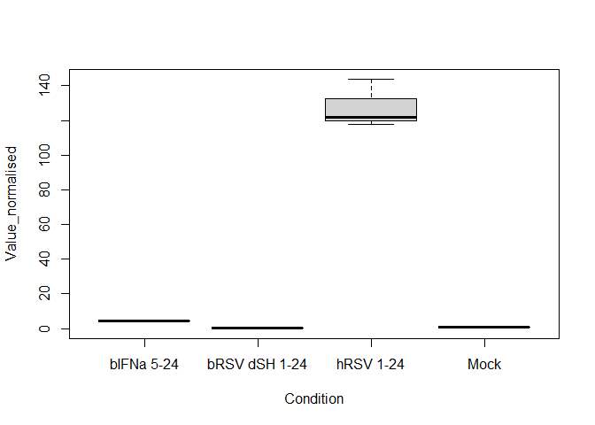
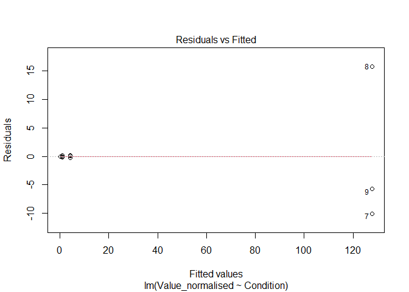
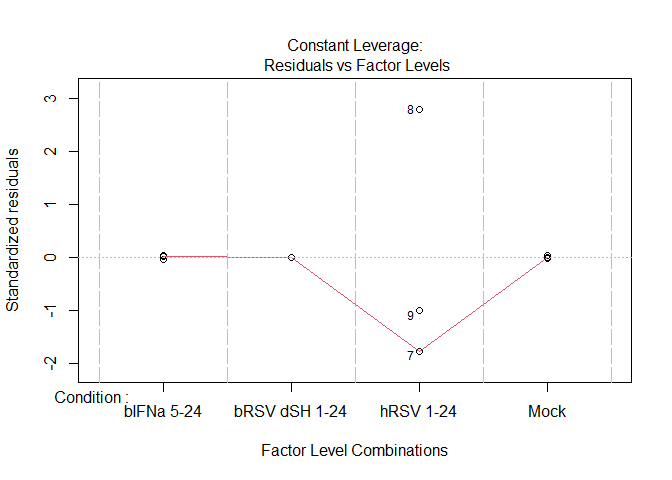

Example of qPCR Pipeline Usage
================
Michal Varga
Last edited: 2024-10-24

# Introduction

Purpose:

based on scripts:

- standard curve
- control gene Ct based
- Copy number GAPDH normalised dataset

parameters incuded in script:

- `target_gene:` bIFIT1
- `housekeeping_gene:` bGAPDH
- `conditions:` !r c(‘Mock’, ‘phRSV 1-24’,‘bIFNa 5-6’)
- `colors:` !r c(‘\#999999’, ‘\#ffc034’, ‘\#9a6a00’)
- `statistics:` “Normal distribution and equal variance”
- `pvals:` !r c(0.9935156, 0.1817141)
- `range:` 14
- `breaks:` 2

Link to stats pipeline?

## Libraries (maybe put them when they are used?)

``` r
library(tidyverse)
library(data.table)
library(ggsignif)
library(scales)
```

# 1. Standard Curve

## Introduction

Some text about what the fuck

## Data Loading

Load `standard_curves_data.csv` from `/Data` folder, and filter the
target gene and primer set used based on the declared parameters in
YAML.

``` r
standard_curve_data <- fread('../Data/standard_curves_data.csv') %>%
  filter(Target == params$target_gene,
         Primer_set == params$primer_set)
```

|        Ct | Copy_number | Primer_set | Target | Experiment | Additional_info |
|----------:|------------:|:-----------|:-------|:-----------|:----------------|
|  7.664552 |       1e+08 | PS11       | bIFIT1 | NA         | NA              |
| 11.265419 |       1e+07 | PS11       | bIFIT1 | NA         | NA              |
| 14.448029 |       1e+06 | PS11       | bIFIT1 | NA         | NA              |
| 17.917984 |       1e+05 | PS11       | bIFIT1 | NA         | NA              |
| 21.056202 |       1e+04 | PS11       | bIFIT1 | NA         | NA              |
| 22.973955 |       1e+03 | PS11       | bIFIT1 | NA         | NA              |
| 26.622187 |       1e+02 | PS11       | bIFIT1 | NA         | NA              |

## Linear Model Production

### Construct Linear Model

``` r
model_standard_curve <- lm(log10(Copy_number)~Ct, data = standard_curve_data)
```

    ## 
    ## Call:
    ## lm(formula = log10(Copy_number) ~ Ct, data = standard_curve_data)
    ## 
    ## Coefficients:
    ## (Intercept)           Ct  
    ##     10.5888      -0.3208

### Construct a Prediction Based on the Linear Model

``` r
prediction_model_standard_curve <- 10^predict(
  model_standard_curve, 
  interval = 'prediction'
  )
```

    ## Warning in predict.lm(model_standard_curve, interval = "prediction"): predictions on current data refer to _future_ responses

|          fit |          lwr |          upr |
|-------------:|-------------:|-------------:|
| 1.348840e+08 | 4.340240e+07 | 4.191860e+08 |
| 9.436060e+06 | 3.300113e+06 | 2.698066e+07 |
| 8.990821e+05 | 3.288738e+05 | 2.457929e+06 |
| 6.928302e+04 | 2.569156e+04 | 1.868371e+05 |
| 6.821448e+03 | 2.478090e+03 | 1.877743e+04 |
| 1.654456e+03 | 5.848611e+02 | 4.680130e+03 |
| 1.117612e+02 | 3.650013e+01 | 3.422060e+02 |

``` r
data_combined_standard_curve <- cbind(
  standard_curve_data,
  prediction_model_standard_curve
  ) # save it to a variabel
```

| Ct | Copy_number | Primer_set | Target | Experiment | Additional_info | fit | lwr | upr |
|---:|---:|:---|:---|:---|:---|---:|---:|---:|
| 7.664552 | 1e+08 | PS11 | bIFIT1 | NA | NA | 1.348840e+08 | 4.340240e+07 | 4.191860e+08 |
| 11.265419 | 1e+07 | PS11 | bIFIT1 | NA | NA | 9.436060e+06 | 3.300113e+06 | 2.698066e+07 |
| 14.448029 | 1e+06 | PS11 | bIFIT1 | NA | NA | 8.990821e+05 | 3.288738e+05 | 2.457929e+06 |
| 17.917984 | 1e+05 | PS11 | bIFIT1 | NA | NA | 6.928302e+04 | 2.569156e+04 | 1.868371e+05 |
| 21.056202 | 1e+04 | PS11 | bIFIT1 | NA | NA | 6.821448e+03 | 2.478090e+03 | 1.877743e+04 |
| 22.973955 | 1e+03 | PS11 | bIFIT1 | NA | NA | 1.654456e+03 | 5.848611e+02 | 4.680130e+03 |
| 26.622187 | 1e+02 | PS11 | bIFIT1 | NA | NA | 1.117612e+02 | 3.650013e+01 | 3.422060e+02 |

### Calculate Amplification Efficiency

Some text about what the fuck are we doing

Put amplification efficiency equation

``` math
\text{Amplification Efficiency} = 10^{-1/\text{slope}}-1
```

``` r
efficiency_standard_curve <- paste(
  round(
    (10^(-1/ lm(Ct~log10(Copy_number), 
                data = standard_curve_data)[[1]][2]) -1)*100, 
    digits = 2), 
  '% Amplification Efficiency', 
  sep = ''
  ) # save it as a variable
```

    ## [1] "110% Amplification Efficiency"

## Figure

### Constructing Figure

``` r
plot_title_standardCurve <- paste(params$target_gene, 
                    '-', 
                    params$primer_set,
                    'Standard Curve', 
                    sep = " ")
x_annotation_position_standardCurve <- 1000000
y_annotation_position_standardCurve <- 37.5
top_range_standardCurve <- 40
y_axis_title_standardCurve <- 'Cycle Threshold'
x_axis_title_standardCurve <- 'Copy Number'
```

``` r
plot_standard_curve <- ggplot(
  data = data_combined_standard_curve,
  mapping = aes(x = Copy_number,
                y = Ct)) +
  geom_point() +
  stat_smooth(method = lm) +
  labs(
    title = plot_title_standardCurve,
    y = x_axis_title_standardCurve,
    x = y_axis_title_standardCurve
  )
```

``` r
plot_standard_curve <- plot_standard_curve +
  scale_y_continuous(
    breaks = seq(from = 0, 
                 to = top_range_standardCurve, 
                 by = 10),
    limits = c(0,top_range_standardCurve)
  )
```

``` r
plot_standard_curve <- plot_standard_curve +
  scale_x_log10(
    labels = trans_format("log10", 
                          math_format(10^.x)),
    breaks = trans_breaks("log10", 
                          function(x) 10^x)
  ) +
  annotation_logticks(sides='b')
```

``` r
plot_standard_curve <- plot_standard_curve +
  theme_bw() +
  theme(
  plot.title = element_text(
    size = 15, 
    face = 'bold', 
    margin = margin(8, 0, 8, 0), 
    hjust = 0.5
  ),
  axis.text.y = element_text(
    angle = 0, 
    size = 9, 
    vjust = 0.5),
  axis.text.x.bottom = element_text(
    angle = 0, 
    size = 9, 
    vjust = 0.5),
  axis.title.x = element_text(
    size = 12, 
    face = 'bold', 
    vjust = -0.5, 
    margin = margin(0, 8, 0, 0)),
  axis.title.y = element_text(
    size = 12, 
    face='bold', 
    vjust=-0.5, 
    margin = margin(0, 8, 0, 0)),
  aspect.ratio = 1/2
)
```

``` r
plot_standard_curve <- plot_standard_curve +
  annotate('text',
           y = y_annotation_position_standardCurve, 
           x = x_annotation_position_standardCurve, 
           label = efficiency_standard_curve, 
           size = 5)
```

    ## `geom_smooth()` using formula = 'y ~ x'

<!-- -->

### Saving Figure

``` r
ggsave(filename = paste(
  paste("plot_standard_curve", 
                    params$target_gene, 
                    params$primer_set,
                    sep = "_"), '.png', sep = ''), 
       plot = plot_standard_curve, 
       device = 'png', 
       path = '../Figures', 
       dpi = 600, 
       height = 16, 
       width = 20, 
       units = 'cm')
```

    ## `geom_smooth()` using formula = 'y ~ x'

# 2. Housekeeping Gene Control

## Introduction

Some text about what the fuck

## Data Loading

Load `ct_data.csv` from `/Data` folder, and filter the target gene and
primer set used based on the declared parameters in YAML.

``` r
housekeeping_gene_data <- fread('../Data/ct_data.csv') %>% 
  filter(Target == params$housekeeping_gene, 
         Cell_line == params$cell_line,
         Condition %in% params$conditions)
```

|       Ct | Target | Condition     | Cell_line | Additional_info |
|---------:|:-------|:--------------|:----------|:----------------|
| 25.22434 | bGAPDH | bRSV dSH 1-24 | MDBK      | NA              |
| 26.25955 | bGAPDH | bRSV dSH 1-24 | MDBK      | NA              |
| 25.54487 | bGAPDH | bRSV dSH 1-24 | MDBK      | NA              |
| 22.78984 | bGAPDH | hRSV 1-24     | MDBK      | NA              |
| 22.28562 | bGAPDH | hRSV 1-24     | MDBK      | NA              |
| 21.41880 | bGAPDH | hRSV 1-24     | MDBK      | NA              |
| 22.23001 | bGAPDH | Mock          | MDBK      | NA              |
| 22.17195 | bGAPDH | Mock          | MDBK      | NA              |
| 22.01028 | bGAPDH | Mock          | MDBK      | NA              |

## Processing Data

wriet about what the fuck is happening

equation for ddCt

``` math
\text{Relative Quantification} = 2^{\Updelta\Updelta \text{Ct}}
```

``` math
\Updelta\Updelta \text{Ct} = \Updelta \text{Ct}_{\text{Test Samples}}-\Updelta \text{Ct}_{\text{Calibrator Samples}}
```

``` math
\Updelta \text{Ct}_{\text{Test Samples}} = \text{Ct}_{\text{Target Gene in Tests}}-\text{Ct}_{\text{Reference Gene in Tests}}
```

``` math
\Updelta \text{Ct}_{\text{Calibrator Samples}} = \text{Ct}_{\text{Target Gene in Calibrator}}-\text{Ct}_{\text{Reference Gene in Calibrator}}
```

``` r
housekeeping_gene_data <- housekeeping_gene_data |> mutate(
  control_mean = mean(
    Ct[Condition == params$conditions[1]],
    na.rm = T),
  log2_dCt = 2^ (- (Ct - control_mean)),
  control_mean_log = mean(
    log2_dCt[Condition == params$conditions[1]],
    na.rm = T),
  Value_norm = log2_dCt / control_mean_log
)
```

| Ct | Target | Condition | Cell_line | Additional_info | control_mean | log2_dCt | control_mean_log | Value_norm |
|---:|:---|:---|:---|:---|---:|---:|---:|---:|
| 25.22434 | bGAPDH | bRSV dSH 1-24 | MDBK | NA | 22.13742 | 0.1176908 | 1.0021 | 0.1174441 |
| 26.25955 | bGAPDH | bRSV dSH 1-24 | MDBK | NA | 22.13742 | 0.0574268 | 1.0021 | 0.0573064 |
| 25.54487 | bGAPDH | bRSV dSH 1-24 | MDBK | NA | 22.13742 | 0.0942440 | 1.0021 | 0.0940465 |
| 22.78984 | bGAPDH | hRSV 1-24 | MDBK | NA | 22.13742 | 0.6362078 | 1.0021 | 0.6348746 |
| 22.28562 | bGAPDH | hRSV 1-24 | MDBK | NA | 22.13742 | 0.9023694 | 1.0021 | 0.9004784 |
| 21.41880 | bGAPDH | hRSV 1-24 | MDBK | NA | 22.13742 | 1.6455992 | 1.0021 | 1.6421508 |
| 22.23001 | bGAPDH | Mock | MDBK | NA | 22.13742 | 0.9378337 | 1.0021 | 0.9358684 |
| 22.17195 | bGAPDH | Mock | MDBK | NA | 22.13742 | 0.9763464 | 1.0021 | 0.9743004 |
| 22.01028 | bGAPDH | Mock | MDBK | NA | 22.13742 | 1.0921197 | 1.0021 | 1.0898311 |

## Factorisation

REMANE ME!!!

``` r
housekeeping_gene_data <- aggregate(x=housekeeping_gene_data, 
                                    by=list(housekeeping_gene_data$Condition),
                                    FUN = mean)
```

    ## Warning in mean.default(X[[i]], ...): argument is not numeric or logical:
    ## returning NA
    ## Warning in mean.default(X[[i]], ...): argument is not numeric or logical:
    ## returning NA
    ## Warning in mean.default(X[[i]], ...): argument is not numeric or logical:
    ## returning NA
    ## Warning in mean.default(X[[i]], ...): argument is not numeric or logical:
    ## returning NA
    ## Warning in mean.default(X[[i]], ...): argument is not numeric or logical:
    ## returning NA
    ## Warning in mean.default(X[[i]], ...): argument is not numeric or logical:
    ## returning NA
    ## Warning in mean.default(X[[i]], ...): argument is not numeric or logical:
    ## returning NA
    ## Warning in mean.default(X[[i]], ...): argument is not numeric or logical:
    ## returning NA
    ## Warning in mean.default(X[[i]], ...): argument is not numeric or logical:
    ## returning NA

``` r
housekeeping_gene_data <- housekeeping_gene_data %>%
  arrange(match(Group.1, params$conditions))

housekeeping_factor_vector <- rep(housekeeping_gene_data$Value_norm, each=3)
```

# 3. Factorised Copy Number Extrapolation

## Introduction

Some text about what the fuck

## Data loading and filtering

Load `ct_data.csv` from `/Data` folder, and filter the target gene and
primer set used based on the declared parameters in YAML.

``` r
target_data <- fread('../Data/copy_number_extrapolation_data.csv') %>%
  filter(Target == params$target_gene,
         Cell_line == params$cell_line,
         Condition %in% params$conditions)
```

| Copy_number |       Ct | Target | Condition     | Cell_line | Additional_info |
|:------------|---------:|:-------|:--------------|:----------|:----------------|
| NA          | 25.90040 | bIFIT1 | bRSV dSH 1-24 | MDBK      | NA              |
| NA          | 25.76134 | bIFIT1 | bRSV dSH 1-24 | MDBK      | NA              |
| NA          | 25.85236 | bIFIT1 | bRSV dSH 1-24 | MDBK      | NA              |
| NA          | 23.95345 | bIFIT1 | hRSV 1-24     | MDBK      | NA              |
| NA          | 23.68442 | bIFIT1 | hRSV 1-24     | MDBK      | NA              |
| NA          | 23.90436 | bIFIT1 | hRSV 1-24     | MDBK      | NA              |
| NA          | 26.85368 | bIFIT1 | Mock          | MDBK      | NA              |
| NA          | 26.95577 | bIFIT1 | Mock          | MDBK      | NA              |
| NA          | 26.59759 | bIFIT1 | Mock          | MDBK      | NA              |

## Copy number extrapolation

``` r
target_data_modelled <- target_data |> 
  mutate(
    Copy_number = 10^predict(model_standard_curve, 
                             newdata = target_data))
```

| Copy_number |       Ct | Target | Condition     | Cell_line | Additional_info |
|------------:|---------:|:-------|:--------------|:----------|:----------------|
|   190.47700 | 25.90040 | bIFIT1 | bRSV dSH 1-24 | MDBK      | NA              |
|   211.08230 | 25.76134 | bIFIT1 | bRSV dSH 1-24 | MDBK      | NA              |
|   197.35705 | 25.85236 | bIFIT1 | bRSV dSH 1-24 | MDBK      | NA              |
|   802.47089 | 23.95345 | bIFIT1 | hRSV 1-24     | MDBK      | NA              |
|   978.89747 | 23.68442 | bIFIT1 | hRSV 1-24     | MDBK      | NA              |
|   832.10689 | 23.90436 | bIFIT1 | hRSV 1-24     | MDBK      | NA              |
|    94.19516 | 26.85368 | bIFIT1 | Mock          | MDBK      | NA              |
|    87.35248 | 26.95577 | bIFIT1 | Mock          | MDBK      | NA              |
|   113.81027 | 26.59759 | bIFIT1 | Mock          | MDBK      | NA              |

## Save data

PUT CODE TO SAVE ANALYSED DATA

## Factorisation based on housekeeping gene levels

wriet about what the fuck is happening

equation for ddCt

``` math
\text{Relative Quantification} = 2^{\Updelta\Updelta \text{Ct}}
```

``` math
\Updelta\Updelta \text{Ct} = \Updelta \text{Ct}_{\text{Test Samples}}-\Updelta \text{Ct}_{\text{Calibrator Samples}}
```

``` math
\Updelta \text{Ct}_{\text{Test Samples}} = \text{Ct}_{\text{Target Gene in Tests}}-\text{Ct}_{\text{Reference Gene in Tests}}
```

``` math
\Updelta \text{Ct}_{\text{Calibrator Samples}} = \text{Ct}_{\text{Target Gene in Calibrator}}-\text{Ct}_{\text{Reference Gene in Calibrator}}
```

``` r
target_data_modelled_ddct_factorised <- target_data_modelled |> 
  mutate(
    Factor = housekeeping_factor_vector,
    Copy_number_modified = Copy_number / Factor,
    Control_mean = mean(
      Copy_number_modified[Condition == params$conditions[1]], 
      na.rm = T
    ),
    Value_normalised = Copy_number_modified / Control_mean
  )
```

| Copy_number | Ct | Target | Condition | Cell_line | Additional_info | Factor | Copy_number_modified | Control_mean | Value_normalised |
|---:|---:|:---|:---|:---|:---|---:|---:|---:|---:|
| 190.47700 | 25.90040 | bIFIT1 | bRSV dSH 1-24 | MDBK | NA | 1.000000 | 190.4770 | 1098.814 | 0.1733479 |
| 211.08230 | 25.76134 | bIFIT1 | bRSV dSH 1-24 | MDBK | NA | 1.000000 | 211.0823 | 1098.814 | 0.1921002 |
| 197.35705 | 25.85236 | bIFIT1 | bRSV dSH 1-24 | MDBK | NA | 1.000000 | 197.3570 | 1098.814 | 0.1796092 |
| 802.47089 | 23.95345 | bIFIT1 | hRSV 1-24 | MDBK | NA | 1.059168 | 757.6427 | 1098.814 | 0.6895098 |
| 978.89747 | 23.68442 | bIFIT1 | hRSV 1-24 | MDBK | NA | 1.059168 | 924.2136 | 1098.814 | 0.8411014 |
| 832.10689 | 23.90436 | bIFIT1 | hRSV 1-24 | MDBK | NA | 1.059168 | 785.6232 | 1098.814 | 0.7149740 |
| 94.19516 | 26.85368 | bIFIT1 | Mock | MDBK | NA | 0.089599 | 1051.2966 | 1098.814 | 0.9567561 |
| 87.35248 | 26.95577 | bIFIT1 | Mock | MDBK | NA | 0.089599 | 974.9266 | 1098.814 | 0.8872538 |
| 113.81027 | 26.59759 | bIFIT1 | Mock | MDBK | NA | 0.089599 | 1270.2177 | 1098.814 | 1.1559901 |

## Statistics

based on the [statistics
pipeline](../Reports/Templates/Statistic-pipeline.md)

### Visual Assesment

#### Normal Distribution by Boxplot

``` r
boxplot(Value_normalised~Condition, target_data_modelled_ddct_factorised)
```

<!-- -->

#### Testing equality of variance assumptions

``` r
plot(lm(Value_normalised~Condition, target_data_modelled_ddct_factorised))
```

<!-- --><!-- --><!-- --><!-- -->

**1st and the last plots:** we want symmetrical data about the 0
horizontal line

**2nd plot:** we want residual points to be as close to the predicted
line as possible

**3rd plot:** we want for red line to be approx. horizontal

### Assumption of Normality

**p value \> 0.05 means normal distribution**

``` r
shapiro.test(target_data_modelled_ddct_factorised$Value_normalised[1:3]) # test all values in one condition
```

    ## 
    ##  Shapiro-Wilk normality test
    ## 
    ## data:  target_data_modelled_ddct_factorised$Value_normalised[1:3]
    ## W = 0.96452, p-value = 0.6381

``` r
shapiro.test(target_data_modelled_ddct_factorised$Value_normalised[4:6]) # test all values in one condition
```

    ## 
    ##  Shapiro-Wilk normality test
    ## 
    ## data:  target_data_modelled_ddct_factorised$Value_normalised[4:6]
    ## W = 0.87185, p-value = 0.3008

``` r
shapiro.test(target_data_modelled_ddct_factorised$Value_normalised[7:9]) # test all values in one condition
```

    ## 
    ##  Shapiro-Wilk normality test
    ## 
    ## data:  target_data_modelled_ddct_factorised$Value_normalised[7:9]
    ## W = 0.92792, p-value = 0.4809

``` r
shapiro.test(residuals(lm(Value_normalised~Condition, target_data_modelled_ddct_factorised))) # test all values in the whole dataset
```

    ## 
    ##  Shapiro-Wilk normality test
    ## 
    ## data:  residuals(lm(Value_normalised ~ Condition, target_data_modelled_ddct_factorised))
    ## W = 0.93414, p-value = 0.5217

**NON NORMAL DISTRIBUTION**

### Assumption of homogeniety of variance for non normal distribution

**p value \> 0.05 means equal variance**

``` r
library(car, quietly = TRUE)
```

    ## 
    ## Attaching package: 'car'

    ## The following object is masked from 'package:dplyr':
    ## 
    ##     recode

    ## The following object is masked from 'package:purrr':
    ## 
    ##     some

``` r
leveneTest(Value_normalised~Condition, target_data_modelled_ddct_factorised)
```

    ## Warning in leveneTest.default(y = y, group = group, ...): group coerced to
    ## factor.

    ## Levene's Test for Homogeneity of Variance (center = median)
    ##       Df F value Pr(>F)
    ## group  2  1.0632 0.4025
    ##        6

**EQUAL VARIANCE OF RESIDUALS**

### Statistical Parameters for Non-Normal Distribution and Equal Variance

``` r
library(dunn.test, quietly = T)
dunn.test(target_data_modelled_ddct_factorised$Value_normalised, 
          target_data_modelled_ddct_factorised$Condition, 
          altp=T,
          list=T)
```

    ##   Kruskal-Wallis rank sum test
    ## 
    ## data: x and group
    ## Kruskal-Wallis chi-squared = 7.2, df = 2, p-value = 0.03
    ## 
    ## 
    ##                            Comparison of x by group                            
    ##                                 (No adjustment)                                
    ## Col Mean-|
    ## Row Mean |   bRSV dSH   hRSV 1-2
    ## ---------+----------------------
    ## hRSV 1-2 |  -1.341640
    ##          |     0.1797
    ##          |
    ##     Mock |  -2.683281  -1.341640
    ##          |    0.0073*     0.1797
    ## 
    ## 
    ## List of pairwise comparisons: Z statistic (p-value)
    ## -----------------------------------------------
    ## bRSV dSH 1-24 - hRSV 1-24 : -1.341640 (0.1797)
    ## bRSV dSH 1-24 - Mock      : -2.683281 (0.0073)*
    ## hRSV 1-24 - Mock          : -1.341640 (0.1797)
    ## 
    ## alpha = 0.05
    ## Reject Ho if p <= alpha

Kruskal test finds there is any significant difference across the whole
dataset. If the p-value is **ABOVE** 0.05 the analysis should be stopped
here without comparing groups!

Important parameters: chi-squared and p-value (include in reports)

The dunn test displays both comparison matrix and comparison list of
tested groups. P values are the individual p values between group
combinations.

**Test passed**

Group-wise comparison is below:

bRSV dSH 1-24 - hRSV 1-24 : -1.341640 (0.1797) bRSV dSH 1-24 - Mock :
-2.683281 (0.0073)\* hRSV 1-24 - Mock : -1.341640 (0.1797)

## Plotting

``` r
plot_target_data +
  geom_signif(
    comparisons = list(c(
      params$conditions[1], 
      params$conditions[2])), 
    annotation = params$pvals[1], 
    y_position = 0.93*params$range - 1*(params$range*0.075), 
    tip_length = 0, vjust= -0.2, size = 0.7,
    textsize = textsize_values[1]) +
              
  geom_signif(
    comparisons = list(c(
      params$conditions[1], 
      params$conditions[3])), 
    annotation = params$pvals[2], 
    y_position = 0.93*params$range - 0*(params$range*0.075), 
    tip_length = 0, vjust= -0.2, size = 0.7, 
    textsize = textsize_values[2])
```
